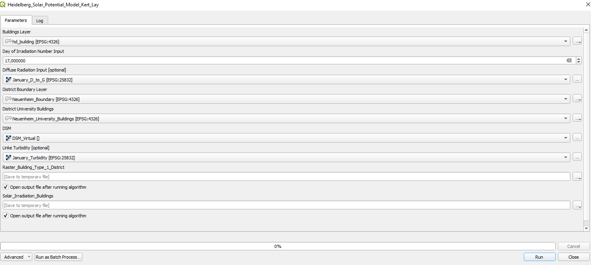
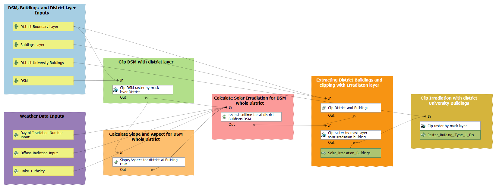

# Solar Potential Analysis In Neuenheim: To what extent can free available, open-source geodata and GIS tools (FOSS) be used to assess the rooftop solar potential of urban buildings? Further, are any spatial patterns between different building types to be seen?

## Project Description
This documentation explains the steps taken for the implementation of our solar potential model, including the collected data, pre-processing, and instructions on how to run the model with the required inputs.

## Methodology

### Data Collection
For our project we used the following data:

  - A digital surface model (DSM; 1 m resolution) from LGL ([Landesamt für Geoinformation und Landentwicklung Baden-Württemberg](https://opengeodata.lgl-bw.de/#/(sidenav:product/dgm1))).
  - Building and district boundaries vector layer from OSM (OpenStreetMap).
    * https://export.hotosm.org/v3/
    * https://osm-boundaries.com/
  - A csv for the diffuse to global (d/g) solar radiation ration for the year 2023 from the Photovoltaic Geographical Information System (PVGIS). It is the monthly value of the ratio of the diffuse and the global horizontal irradiation, i.e. the fraction of the total solar irradiation that comes from the clouds and the sky ([Photovoltaic Geographical Information System 2024](https://re.jrc.ec.europa.eu/pvg_tools/en/)).
  - The linke turbidity factor values for Heidelberg from ([Meteonorm version 8.0](https://mn8.meteonorm.com/)), a tool that provides time series weather data. Since Meteonorm uses long-term climatic data from various sources to estimate typical atmospheric conditions for a specific location it doesn't allow the selection of a specific year. "The Linke turbidity factor is a very convenient approximation to model the atmospheric absorption and scattering of the solar radiation under clear skies. It describes the optical thickness of the atmosphere due to both the absorption by the water vapor and the absorption and scattering by the aerosol particles relative to a dry and clean atmosphere. It summarizes the turbidity of the atmosphere, and hence the attenuation of the direct beam solar radiation." (Remund et. al 2003).

### Data pre-processing
Before we can load the collected data into our model, we first have to pre-process it.

* Since the DSM can only be downloaded as separate 2 km x 2 km tiles, we have to merge all of the needed DSM tiles. For this we create a virtual raster layer of the DSM tiles. Virtual rasters are useful because they allow handling of large datasets as if they were a single file eliminating need for locating correct files.
* Since we want to analyze the solar potential for the district Neuenheim we extract its boundary out of the district boundaries layer and create a new vector layer for the district boundary.
* We want to analyze the solar potential for all building rooftops in Neuenheim and separately for university building rooftops. So, we extract all university buildings from the building vector layer and then clip this new layer with the boundary layer for Neuenheim to create a new vector layer containing only the university buildings for the district.
* The csv file of the diffuse to global solar irradiation ration also needs to be pre-processed. For each month we create a new constant raster layer containing the value of the diffuse to global irradiation ratio of the corresponding month. This is important as the solar irradiation we analyze will be calculated for the recommend average day of each month.
* Since we used the demo version of Meteonorm 8.0 we could only see the values of the linke turbidity factor and not extract them in a file. Therefore we have to create a new constant raster layer for each month containing the corresponding linke turbidity factor value.

### Model Design
Our model has the following seven inputs.

*Fig. 4: The Inputs of our QGIS-Model*

* District Boundary Layer, **vector layer input**: A vector layer containing the boundary of the district in Heidelberg you want to analyze. 
* Buildings Layer, **vector layer input**: A vector layer containing all buildings in Heidelberg.
* District University Buildings, **vector layer input**: A vector layer containing the university buildings for the district in Heidelberg you want to analyze.
* DSM, **raster layer input**: A raster layer containing the DSM data for Heidelberg.
* Day of Irradiation Number Input, **string input**: A number input for the specific day you want to analyze. Goes from 1 to 365. We used the recommended average days for each month from Duffie & Beckman 2013.
* Diffuse Radiation Input, **raster layer input**: 12 constant raster layers containing the value of the diffuse to global radiation coefficient for each month.
* Linke Turbidity, **raster layer input**: 12 constant raster layers containing the value of the linke turbidity factor for each month.

*Fig. 5: The QGIS-Model*

With these inputs our model, with the GDAL tool **Clip raster by mask layer** first clips the DSM with the District Boundary Layer to shrink the DSM to the extent of the district we want to analyze. This is important as an analysis of the full DSM of Heidelberg needs too much computing power and crashed QGIS. In the next step we calculate the slope and aspect of the created district DSM layer with the GRASS GIS tool **r.slope.aspect**. Then with the tool **r.sun.insoltime**, the weather data inputs, the district DSM layer and the calculated slope and aspect of the district, we calculate the global solar irradiation for the whole district. In the next step with the QGIS tool **Clip** the model clips the Buildings Layer with the District Boundary Layer, to create a new layer containing only the buildings of the specific district. After this with the GDAL tool **Clip raster by mask layer** the model clips the global solar irradiation layer with the created district buildings layer to get a raster layer containing the global solar irradiation on the building rooftops of the specific district. In the last step, this with the GDAL tool **Clip raster by mask layer**, the rooftop global solar irradiation layer will be clipped with the District University Buildings layer to create a raster layer containing only the calculated solar irradiation on university building rooftops.

## Limitations

With the use of OSM data, it can't be guaranteed that the building data is complete or accurate (e.g. building type). So, the data should be taken with caution. Further, our model is based on potential solar irradiation, meaning that all buildings in the selected district are evaluated to identify suitable rooftops for installing solar panels based on that parameter. But suitability also depends on other factors like roof materials, which the model has no information about.

## Help

The standard QGIS folder for temporary files was too small. Our model could not create the layers for the global solar irradiation. Therefore we had to change the folder for temporary files.
For this we created a new folder and then set it as the standard folder for temporary files in QGIS. In QGIS under settings > options > system > environment you can overwrite the QGIS folder for temporary files with a new folder you choose.

## Authors

* Pui-Yi Lay
* Felix Kert

## Sources

* Remund, J. & Wald, L. & Lefèvre, M. & Ranchin, T. & Page, J. H. (2003): Worldwide Linke turbidity information. In: ISES Solar World Congress, Göteborg, Sweden. P 13.
* Usta, Y., Carioni, G. & Mutani, G. (2024): Modeling and mapping solar energy production with photovoltaic panels on Politecnico di Torino university campus. In: Energy Efficiency 17, 53.
* Duffie, J. A. & Beckman, W. A. (2013): Solar Engineering of Thermal Processes. 4. Edition. Hoboken, New Jersey: John Wiley & Sons, Inc.
* Photovoltaic Geographical Information System (2024): Interactive tools. Online: https://re.jrc.ec.europa.eu/pvg_tools/en/ (accessed on 23.03.2025).
